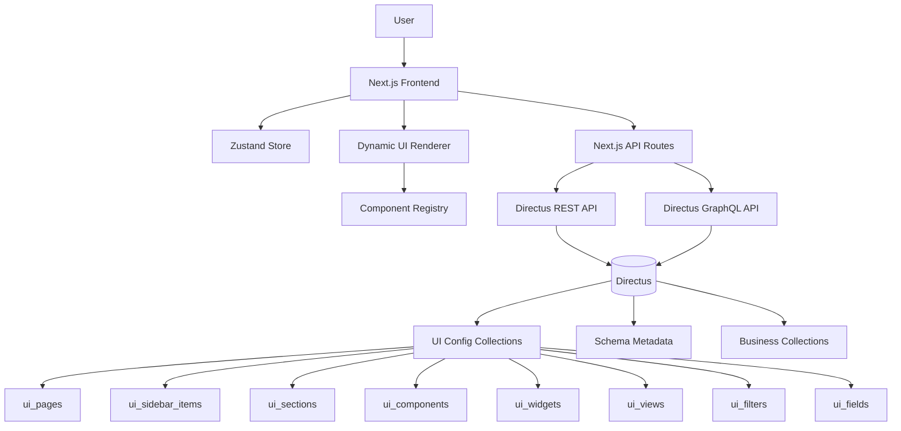
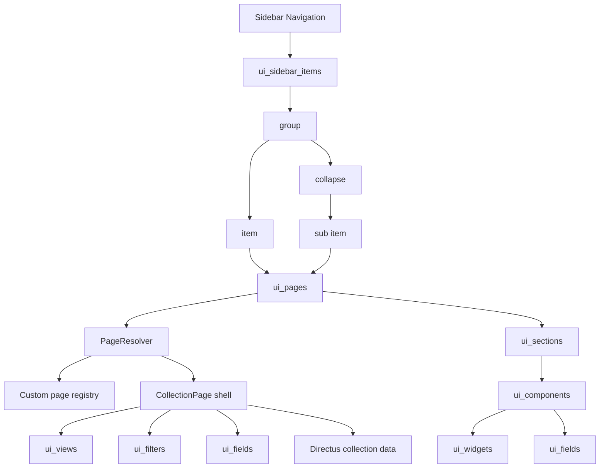
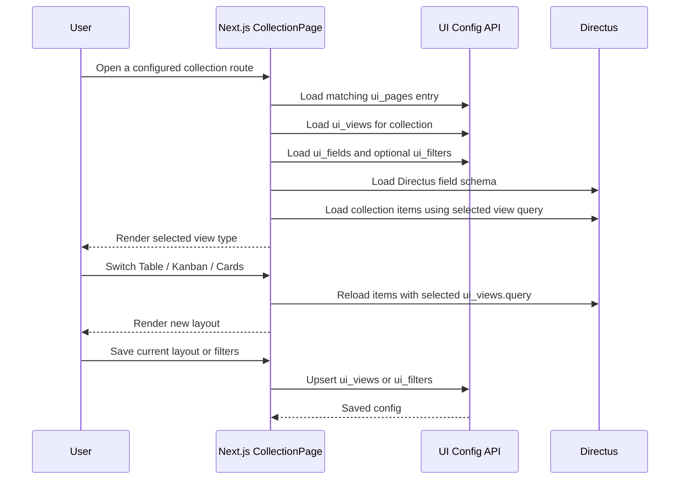
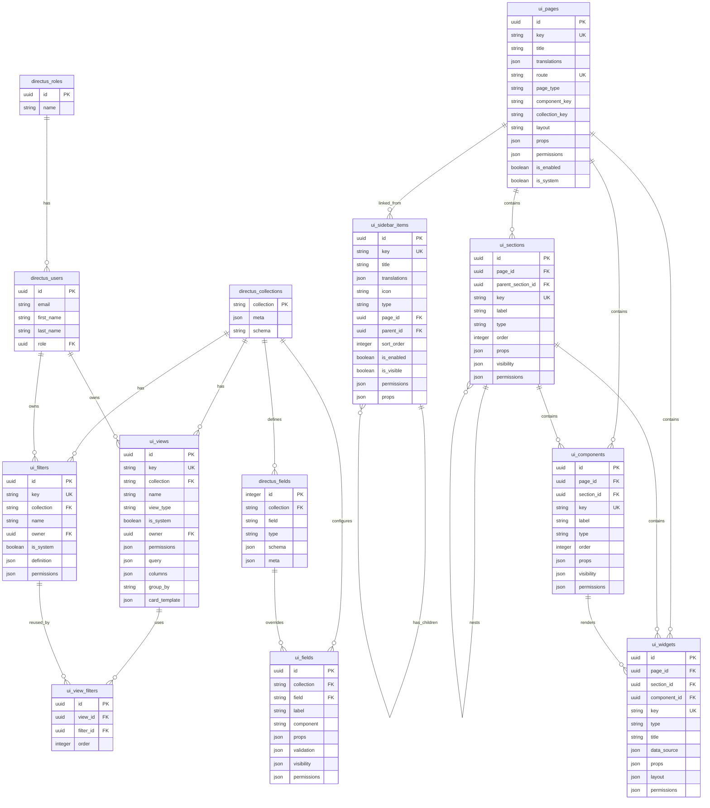

# CX2.0 Frontend Architecture

## Purpose

This document is the single architecture reference for the CX2.0 frontend.

It explains how the Next.js UI renders CRM screens from Directus configuration, how collection pages support saved views and filters, how custom fields are handled, and when the frontend should use REST or GraphQL.

## Architecture Goals

- Store configurable UI structure in Directus so non-developers can adjust screens, views, fields, and layouts.
- Keep the frontend consistent by rendering all dynamic UI through typed components and a component registry.
- Use Directus schema metadata as the source of truth for collections, fields, relations, and custom fields.
- Support reusable collection pages with saved views such as table, kanban, and cards.
- Keep privileged schema/admin operations server-side.
- Use one clear API strategy: REST by default, GraphQL only when it reduces complex read queries.

## High-Level Architecture



## Core Concepts

### UI Configuration

Directus stores UI configuration in dedicated collections:

- `ui_pages`: screens, frontend routes, page renderer type, layout shell, page props, and access rules.
- `ui_sidebar_items`: sidebar navigation tree. Items can point to real pages through `page_id`, or act only as groups/collapsible containers through `parent_id`.
- `ui_sections`: layout regions inside a page.
- `ui_components`: renderable component definitions.
- `ui_widgets`: dashboard or analytics widgets.
- `ui_views`: saved collection views such as table, kanban, and cards.
- `ui_filters`: reusable named filters or segments.
- `ui_fields`: UI-level field configuration layered on top of Directus schema.

Common fields for configurable records:

- `key`: unique stable identifier.
- `label` or `title`: display name.
- `translations`: JSON for localized labels.
- `type`: layout, component, widget, field, view, or sidebar item type.
- `props`: JSON configuration for rendering.
- `sort_order` or `order`: display order.
- `permissions`: role, user, team, or feature access rules.

### Directus Schema Metadata

Directus remains the source of truth for:

- Business collections.
- Fields and custom fields.
- Field types.
- Relations.
- System metadata.

The frontend reads Directus metadata, then merges it with `ui_fields` to decide labels, renderers, validation, visibility, and table column types.

### Dynamic UI Renderer

The renderer is responsible for:

1. Loading the `ui_pages` record for the current route.
2. Choosing the page renderer from `page_type`, `component_key`, and `collection_key`.
3. Loading related sections, components, widgets, views, filters, and fields when that renderer needs them.
4. Loading Directus schema metadata for the active collection when needed.
5. Normalizing config into typed frontend props.
6. Rendering UI through a component registry.

### State Management

Zustand stores shared client-side state:

- Directus collections and fields.
- Current user/session context.
- Active collection metadata.
- Runtime UI state such as search, pagination, selected view, and local filter state.

Persistent UI preferences should be saved to Directus through `ui_views` or `ui_filters`, not only kept in Zustand.

## Sidebar and Page Model

The frontend separates page definition from navigation definition:

- `ui_pages` defines whether a route exists and how the route should render.
- `ui_sidebar_items` defines what appears in the sidebar, how items nest, and which sidebar item links to which page.

This separation keeps page routing stable even when the sidebar is reorganized. A page can exist without being visible in the sidebar, and a sidebar group can exist without linking to a page.

The current frontend sidebar contract is:

```ts
type SidebarProps = {
  variant?: "default" | "v2";
  menu: Array<{
    groupName?: string;
    groupNameNoTranslate?: boolean;
    groups: Array<{
      id: string;
      label: string;
      groupId: string;
      icon?: LucideIconName | null;
      noTranslate?: boolean;
      href?: string;
      subGroups?: Array<{
        id: string;
        label: string;
        groupId: string;
        noTranslate?: boolean;
        href?: string;
      }>;
    }>;
  }>;
};
```

In this model:

- `ui_sidebar_items.type = "group"` maps to one `SidebarMenu` block and becomes `SidebarMenu.groupName`.
- `ui_sidebar_items.type = "collapse"` maps to a sidebar row that can contain `subGroups`.
- `ui_sidebar_items.type = "item"` maps to a clickable leaf item.
- `ui_sidebar_items.parent_id` builds the nested sidebar tree.
- `ui_sidebar_items.page_id` links a sidebar item to a real `ui_pages` record.
- `ui_sidebar_items.page_id.route` becomes `GroupMenu.href`.
- `ui_sidebar_items.title` / `translations` become labels.
- `ui_sidebar_items.icon` resolves to a Lucide icon key.
- `ui_sidebar_items.sort_order` sorts siblings under the same parent.
- `ui_sidebar_items.is_enabled` and `is_visible` control whether the item should be shown.

`ui_pages` remains responsible for route behavior:

- `route` is the frontend URL matched by `PageResolver`.
- `page_type` selects the renderer, currently `collection` or `custom`.
- `component_key` selects a custom React component from the frontend registry.
- `collection_key` selects the Directus collection for collection pages.
- `layout`, `props`, `permissions`, `is_enabled`, and `is_system` describe page-level behavior and governance.

Recommended sidebar item types:

| Type       | Meaning                                                                        | Usually has `page_id` |
| ---------- | ------------------------------------------------------------------------------ | --------------------- |
| `group`    | Visual menu block header. Children become one `SidebarMenu` group.             | no                    |
| `collapse` | Expandable menu row. Children become nested sub items.                         | optional              |
| `item`     | Clickable navigation item. Links to `page_id.route` when connected to a page.  | yes                   |

Example sidebar tree:

| Sidebar item key       | type       | parent key        | page key        | Rendered as                         |
| ---------------------- | ---------- | ----------------- | --------------- | ----------------------------------- |
| `main_group`           | `group`    | empty             | empty           | Sidebar group header                |
| `dashboard_item`       | `item`     | `main_group`      | `dashboard`     | Link to `/dashboard`                |
| `data_group`           | `group`    | empty             | empty           | Sidebar group header                |
| `collections_collapse` | `collapse` | `data_group`      | empty           | Expandable "Collections" row        |
| `customers_item`       | `item`     | `collections_collapse` | `customers_page` | Link to `/data-models/customers` |
| `settings_group`       | `group`    | empty             | empty           | Sidebar group header                |
| `settings_item`        | `item`     | `settings_group`  | `settings`      | Link to `/settings`                 |



## Collection Page Model

A collection screen is a `ui_pages` entry with `page_type = collection` and a valid `collection_key`. Multiple collection routes can reuse the same `CollectionPage` shell while loading different Directus collection metadata and saved view configuration.

Sidebar links for these pages are optional `ui_sidebar_items` records that point to the collection page through `page_id`.

Use `ui_views` for saved layouts:

- Table view.
- Kanban view.
- Cards view.
- Columns, widths, visibility, and order.
- Sort, search, pagination defaults, and inline filters.
- Kanban `group_by`.
- Cards `card_template`.
- Owner, system/default flag, and permissions.

Use `ui_filters` for reusable named filters:

- Active customers.
- Archived records.
- My open deals.
- High priority tickets.

Rule of thumb:

- Store one-off view filters in `ui_views.query`.
- Store reusable named filters in `ui_filters`.
- Link reusable filters to saved views through `ui_view_filters` if a view can compose multiple filters.



## Recommended Ownership

| Concern                          | Recommended model                            | Example                                      |
| -------------------------------- | -------------------------------------------- | -------------------------------------------- |
| Frontend route and renderer      | `ui_pages`                                   | `/dashboard`, `/analytics`, `/data-models`   |
| Sidebar navigation tree          | `ui_sidebar_items`                           | Main group, Settings collapse, Dashboard item |
| Sidebar item linked to a route   | `ui_sidebar_items.page_id -> ui_pages.id`    | Dashboard item links to `/dashboard`          |
| Unique page layout               | `ui_pages` + `ui_sections` + `ui_components` | Analytics dashboard with charts              |
| Dashboard widget                 | `ui_widgets`                                 | KPI card, chart, recent activity             |
| Collection page shell            | Code component + `ui_pages`                  | Generic `CollectionPage` route               |
| Collection list layout           | `ui_views`                                   | Contacts table, deals kanban, products cards |
| View-specific filter/sort/search | `ui_views.query`                             | My open deals sorted by close date           |
| Reusable named filter            | `ui_filters`                                 | Active customers, archived records           |
| Field label/rendering/validation | `ui_fields`                                  | Format phone number, hide internal field     |
| Directus field schema            | Directus system metadata                     | Field type, relation, required flag          |

## ERD: UI Configuration Relations



## Data Model Definitions

### ui_pages

Purpose: define screens, frontend routes, renderer behavior, layout shell, page props, and page-level governance.

`ui_pages` should answer these questions:

- Does this frontend route exist?
- Which renderer should handle the page?
- Is this a generic collection page or a custom frontend component?
- Which layout shell should render it?
- Which roles/users/features can access it?
- Is this a system page that normal users should not delete or rename?

Recommended Directus collection name: `ui_pages`.

Recommended permissions:

- Admin/tech lead can create, update, and delete non-system pages.
- Normal users can read only enabled pages they have permission to access.
- System pages should be protected from delete and unsafe key/route changes.

Recommended fields, based on `docs/ui_pages.md`:

| Field            | Type        | Required | Notes                                                                                                                            |
| ---------------- | ----------- | -------- | -------------------------------------------------------------------------------------------------------------------------------- |
| `id`             | uuid / ulid | yes      | Primary key.                                                                                                                     |
| `key`            | string      | yes      | Unique stable identifier. Use code-friendly values such as `dashboard`, `customers_page`, `settings`. Do not change casually.    |
| `title`          | string      | yes      | Default page name. Used by page headers, breadcrumbs, metadata, and as fallback display text.                                    |
| `translations`   | json        | no       | Localized data for `title`, `description`, and breadcrumbs.                                                                       |
| `route`          | string      | yes      | Unique frontend route, for example `/dashboard` or `/data-models/customers`. Must start with `/`.                               |
| `page_type`      | enum        | yes      | Page renderer type. Current implementation supports `collection` and `custom`.                                                   |
| `component_key`  | string      | no       | Frontend registry key used when `page_type = custom`.                                                                            |
| `collection_key` | string      | no       | Directus collection managed by the page. Required when `page_type = collection`.                                                 |
| `layout`         | string      | no       | Layout shell key, for example `default`, `blank`, or `settings`.                                                                 |
| `props`          | json        | no       | Page/component config passed to the renderer.                                                                                    |
| `permissions`    | json        | no       | Access policy. Start as JSON; normalize later if needed.                                                                         |
| `is_enabled`     | boolean     | yes      | Soft enable/disable flag. Disabled pages should not render.                                                                      |
| `is_system`      | boolean     | yes      | Locks core pages from deletion or unsafe edits.                                                                                  |
| `user_created`   | m2o -> `directus_users` | auto | Directus accountability field.                                                                                       |
| `date_created`   | datetime    | auto     | Directus accountability field.                                                                                                   |
| `user_updated`   | m2o -> `directus_users` | auto | Directus accountability field.                                                                                       |
| `date_updated`   | datetime    | auto     | Directus accountability field.                                                                                                   |

Recommended field constraints:

- `key` unique.
- `route` unique.
- `key` should match `^[a-z][a-z0-9_]*$`.
- `route` should start with `/`.
- `page_type` should use a fixed dropdown.
- `page_type = collection` requires `collection_key`.
- `page_type = custom` requires either `component_key` or a `key` that exists in the frontend `customPageRegistry`.
- `is_enabled` should default to `true`.
- `is_system` should default to `false`.

Recommended `page_type` values:

| Value        | Meaning                                                                 |
| ------------ | ----------------------------------------------------------------------- |
| `collection` | Generic shell for Directus collection browsing and CRUD.                |
| `custom`     | Page rendered by a custom frontend component from `customPageRegistry`. |

Recommended `layout` values:

| Value      | Meaning                                               |
| ---------- | ----------------------------------------------------- |
| `default`  | Standard page layout with breadcrumbs/header/content. |
| `settings` | Settings layout with secondary navigation.            |
| `blank`    | Minimal shell for special pages.                      |

Example records:

| key              | route                    | title      | page_type    | component_key | collection_key |
| ---------------- | ------------------------ | ---------- | ------------ | ------------- | -------------- |
| `dashboard`      | `/dashboard`             | Dashboard  | `custom`     | `dashboard`   | empty          |
| `customers_page` | `/data-models/customers` | Customers  | `collection` | empty         | `customers`    |
| `settings`       | `/settings`              | Settings   | `custom`     | `settings`    | empty          |

Example `translations` JSON:

```json
{
  "vi": {
    "title": "Khach hang",
    "description": "Quan ly danh sach khach hang"
  },
  "en": {
    "title": "Customers",
    "description": "Manage customer records"
  }
}
```

Example `permissions` JSON:

```json
{
  "roles": ["admin", "manager"],
  "users": [],
  "mode": "allow"
}
```

Implementation notes:

- `ui_pages` defines the page shell and route behavior, not sidebar placement.
- Sidebar placement belongs to `ui_sidebar_items`.
- `PageResolver` should query enabled pages by `route`, then render by `page_type`.
- Custom pages must be registered in `customPageRegistry`.
- Collection pages must have a valid `collection_key` that maps to a Directus collection.

### ui_sidebar_items

Purpose: define sidebar navigation items, labels, icons, nesting, order, visibility, and optional links to real pages.

`ui_sidebar_items` should answer these questions:

- Should this item appear in the sidebar?
- Is it a group header, collapsible parent, or clickable item?
- Which page does it link to, if any?
- Where does it sit in the nested sidebar tree?
- Which roles/users/features can see it?

Recommended Directus collection name: `ui_sidebar_items`.

Recommended fields, based on `docs/ui_sidebar_items.md`:

| Field          | Type                              | Required | Notes                                                                 |
| -------------- | --------------------------------- | -------- | --------------------------------------------------------------------- |
| `id`           | uuid / ulid                       | yes      | Primary key.                                                          |
| `key`          | string                            | yes      | Unique stable sidebar item key, for example `dashboard_item`.         |
| `title`        | string                            | yes      | Default label.                                                        |
| `translations` | json                              | no       | Localized label data.                                                 |
| `icon`         | string                            | no       | Lucide icon key, for example `Settings`, `CircleGauge`, `Database`.   |
| `type`         | enum                              | yes      | Sidebar item type: `group`, `collapse`, or `item`.                    |
| `page_id`      | m2o -> `ui_pages.id`              | no       | Link to the real page. Used to resolve `href` from `page_id.route`.   |
| `parent_id`    | m2o -> `ui_sidebar_items.id`      | no       | Self relation used to create nested menu structure.                   |
| `sort_order`   | integer                           | yes      | Sort order within the same parent.                                    |
| `is_enabled`   | boolean                           | yes      | Soft enable/disable flag. Disabled items should not render.           |
| `is_visible`   | boolean                           | yes      | Controls sidebar visibility without deleting the item.                |
| `permissions`  | json                              | no       | Access policy for sidebar visibility.                                 |
| `props`        | json                              | no       | Additional UI config for sidebar rendering.                           |
| `user_created` | m2o -> `directus_users`           | auto     | Directus accountability field.                                        |
| `date_created` | datetime                          | auto     | Directus accountability field.                                        |
| `user_updated` | m2o -> `directus_users`           | auto     | Directus accountability field.                                        |
| `date_updated` | datetime                          | auto     | Directus accountability field.                                        |

Recommended field constraints:

- `key` unique.
- `key` should match `^[a-z][a-z0-9_]*$`.
- `type` should use a fixed dropdown: `group`, `collapse`, `item`.
- `parent_id` should reference `ui_sidebar_items.id`.
- An item must not use itself as `parent_id`; circular parent chains must be blocked in application validation.
- `sort_order` should default to `100`.
- `is_enabled` should default to `true`.
- `is_visible` should default to `true`.

Recommended frontend mapping:

```ts
const sidebarMenu = rootGroups.map((group) => ({
  groupName: resolveLabel(group),
  groupNameNoTranslate: true,
  groups: childrenByParentId[group.id].map((item) => ({
    id: item.id,
    label: resolveLabel(item),
    groupId: group.id,
    icon: resolveIcon(item.icon),
    href: item.page_id?.route,
    noTranslate: true,
    subGroups: childrenByParentId[item.id]?.map((subItem) => ({
      id: subItem.id,
      label: resolveLabel(subItem),
      groupId: item.id,
      href: subItem.page_id?.route,
      noTranslate: true,
    })),
  })),
}));
```

### ui_sections

Purpose: define layout blocks inside pages.

Recommended fields:

- `key` (string, unique)
- `page_id` (m2o -> `ui_pages`)
- `parent_section_id` (m2o -> `ui_sections`, optional)
- `label` (string)
- `type` (string: `header`, `grid`, `tabs`, `panel`, `toolbar`)
- `props` (json)
- `visibility` (json)
- `permissions` (json)
- `order` (integer)

### ui_components

Purpose: define renderable UI components inside pages or sections.

Recommended fields:

- `key` (string, unique)
- `page_id` (m2o -> `ui_pages`, optional)
- `section_id` (m2o -> `ui_sections`, optional)
- `label` (string)
- `type` (string: `table`, `form`, `card`, `tabs`, `button`, `chart`)
- `props` (json)
- `visibility` (json)
- `permissions` (json)
- `order` (integer)

### ui_widgets

Purpose: define dashboard widgets with data sources and visualization settings.

Recommended fields:

- `key` (string, unique)
- `page_id` (m2o -> `ui_pages`)
- `section_id` (m2o -> `ui_sections`, optional)
- `component_id` (m2o -> `ui_components`, optional)
- `type` (string: `chart`, `kpi`, `list`, `table`)
- `title` (string)
- `data_source` (json)
- `props` (json)
- `layout` (json: x/y/w/h for grid)
- `permissions` (json)

### ui_views

Purpose: define saved views for Directus collection pages.

Recommended fields:

- `key` (string, unique)
- `collection` (string, FK -> Directus collection name)
- `name` (string)
- `view_type` (string: `table`, `kanban`, `cards`)
- `is_system` (boolean)
- `owner` (m2o -> `directus_users`, optional)
- `permissions` (json)
- `query` (json: filters, sort, search, pagination defaults)
- `columns` (json: column list, order, width, visibility)
- `group_by` (string, for kanban)
- `card_template` (json, for cards)

### ui_filters

Purpose: define reusable named filters and segments.

Recommended fields:

- `key` (string, unique)
- `collection` (string, FK -> Directus collection name)
- `name` (string)
- `owner` (m2o -> `directus_users`, optional)
- `is_system` (boolean)
- `definition` (json: filter DSL)
- `permissions` (json)

### ui_view_filters

Purpose: optionally link reusable filters to saved views.

Recommended fields:

- `view_id` (m2o -> `ui_views`)
- `filter_id` (m2o -> `ui_filters`)
- `order` (integer)

Use this join collection only if a saved view needs to compose multiple reusable filters. Otherwise, keep filters inline in `ui_views.query`.

### ui_fields

Purpose: define UI-level field behavior layered on top of Directus schema fields.

Recommended fields:

- `collection` (string, FK -> Directus collection name)
- `field` (string, FK -> Directus field name)
- `label` (string)
- `component` (string)
- `props` (json)
- `validation` (json)
- `visibility` (json)
- `permissions` (json)

## Type Mapping Strategy

Map Directus field types to frontend table and form types:

| Directus type                                          | Frontend type         |
| ------------------------------------------------------ | --------------------- |
| `boolean`                                              | `ColumnType.BOOLEAN`  |
| `integer`, `biginteger`, `float`, `decimal`, `numeric` | `ColumnType.NUMBER`   |
| `date`                                                 | `ColumnType.DATE`     |
| `datetime`, `timestamp`                                | `ColumnType.DATETIME` |
| `time`                                                 | `ColumnType.TIME`     |
| `string`, `text`, `uuid`                               | `ColumnType.TEXT`     |

This mapping can be refined by reading Directus field `meta`, `schema`, relation metadata, and `ui_fields.component`.

## API Strategy

Use REST by default. Use GraphQL only when it materially improves a read-heavy screen by reducing round trips or shaping nested data better than REST.

### REST Responsibilities

Use REST for schema, metadata, admin actions, simple CRUD, lists, files, and UI configuration.

Examples:

- `GET /fields/{collection}`
- `GET /fields/{collection}/{field}`
- `GET /collections`
- `GET /relations`
- `POST /fields/{collection}`
- `PATCH /fields/{collection}/{field}`
- `GET /items/{collection}?fields=...&filter=...&sort=...&limit=...&offset=...`
- `POST /items/{collection}`
- `POST /files`
- `GET /assets/{id}`

REST should also be used for:

- Reading and writing `ui_pages`.
- Reading and writing `ui_views`.
- Reading and writing `ui_filters`.
- Reading and writing `ui_fields`.
- Standard collection list and CRUD screens.

### GraphQL Responsibilities

Use GraphQL for read-only screens where the UI needs a custom nested shape.

Good candidates:

- Dashboards with multiple widgets.
- Complex detail pages with several nested relations.
- Analytics pages that need multiple datasets in one request.
- View-specific read queries where REST would require many sequential requests.

GraphQL should be treated as read-only unless there is a specific approved use case.

### API Decision Matrix

| Feature                         | Recommended API                    | Reason                                                |
| ------------------------------- | ---------------------------------- | ----------------------------------------------------- |
| Dynamic UI config               | REST                               | Simple config CRUD and easier governance              |
| Directus schema metadata        | REST                               | Directus REST is strongest for schema/admin metadata  |
| Custom field creation           | REST through server route          | Privileged schema action                              |
| Collection list                 | REST by default                    | Predictable pagination, filters, logging, and caching |
| Collection create/update/delete | REST through server/client wrapper | Simple CRUD                                           |
| Saved views and filters         | REST                               | Config records, not heavy nested reads                |
| Dashboard widgets               | GraphQL read-only when useful      | Multiple datasets in one request                      |
| Complex detail page             | GraphQL read-only when useful      | Nested relations and custom projection                |
| Files and media                 | REST                               | Directus file endpoints                               |

### API Checklist

Before choosing GraphQL, ask:

- Do we need schema metadata? If yes, use REST.
- Is it a privileged action? If yes, use REST through a server route.
- Is this simple CRUD or a paginated list? If yes, use REST.
- Is the response deeply nested or custom shaped? If yes, consider GraphQL.
- Are there multiple independent widget datasets needed at once? If yes, consider GraphQL.
- Do we need predictable caching and logging? If yes, prefer REST.

## Runtime Data Flows

### Standard Collection List

1. User opens a route whose `ui_pages.page_type = collection`.
2. UI loads collection metadata from Zustand or Directus.
3. UI loads Directus fields for the collection.
4. UI loads `ui_fields` overrides.
5. UI loads available `ui_views` and `ui_filters`.
6. UI selects the default view.
7. UI converts the view query into Directus REST query params.
8. UI fetches items from `/items/{collection}`.
9. UI renders table, kanban, or cards.

### Custom Field Creation

1. User creates a field from the UI.
2. UI sends the request to a server-side Next.js API route.
3. Server route validates permission and field config.
4. Server route calls Directus REST schema endpoint with a privileged token.
5. UI refreshes fields and re-renders the affected collection page.

### Dashboard Page

1. User opens dashboard route.
2. UI loads `ui_pages`, `ui_sections`, `ui_components`, and `ui_widgets`.
3. UI groups widgets by data requirements.
4. UI fetches simple config with REST.
5. UI may fetch widget datasets with one GraphQL query if it reduces round trips.
6. UI renders widgets through the registry.

## Security and Governance

- Keep Directus admin/schema tokens server-side only.
- Use separate credentials for schema/admin and read-only data access.
- Hide UI actions based on `permissions`, but still enforce permissions server-side.
- Treat `permissions` JSON as the first implementation stage.
- Normalize permissions into join tables later if role, team, workspace, or approval rules become complex.
- Avoid optimistic UI updates for schema changes until Directus confirms success.
- Audit schema changes and UI config changes where possible.

## Current Implementation Status

Current sidebar and page resolution already:

- Reads sidebar navigation from `ui_sidebar_items`.
- Maps `group`, `collapse`, and `item` records into the frontend `SidebarMenu` shape.
- Uses `page_id.route` as the sidebar link target.
- Resolves dynamic routes by querying `ui_pages.route`.
- Supports `page_type = collection` and `page_type = custom`.

Current `CollectionPage` already:

- Uses one reusable collection page shell.
- Reads Directus collection metadata and fields from Zustand.
- Maps Directus field types to table column types.
- Stores search, pagination, hidden columns, and filters in local React state.
- Renders a `DataTable`.

Current `CollectionPage` does not yet:

- Fetch saved `ui_views`.
- Switch between table, kanban, and cards.
- Persist hidden columns, filters, sorting, grouping, or view type.
- Load reusable `ui_filters`.

To implement saved views, add API support for reading/writing `ui_views` and update `CollectionPage` to initialize runtime UI state from the selected `ui_views` record.

## Implementation Roadmap

1. Define Directus collections for `ui_pages`, `ui_sidebar_items`, `ui_sections`, `ui_components`, `ui_widgets`, `ui_views`, `ui_filters`, `ui_view_filters`, and `ui_fields`, including `ui_sidebar_items.parent_id` as a self foreign key.
2. Add TypeScript types and runtime validation for UI config records.
3. Add REST wrappers for UI config and Directus metadata.
4. Update `CollectionPage` to load `ui_views`, `ui_filters`, and `ui_fields`.
5. Add view switching for table, kanban, and cards.
6. Add save/update/delete behavior for user-owned views.
7. Add permission checks for system views, shared views, and user-owned views.
8. Add GraphQL only for dashboard or complex read-only screens that need nested data.

## Open Design Decisions

- How should UI config be versioned and migrated when Directus schema changes?
- Should saved views support computed fields?
- Should permissions remain JSON or become normalized relation tables?
- What is the canonical query DSL for filters, sort, search, and pagination?
- What view sharing levels are required: user, role, team, workspace, or global?
- How should slow or failing widgets behave?
- How should labels, errors, and saved view names be localized?
